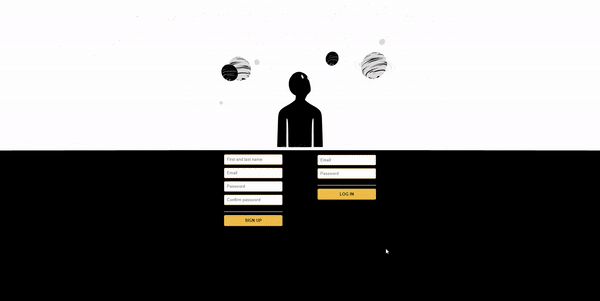

## Byte Bazaar Welcomes You!

Here, you'll find a 3D e-commerce store where you can purchase vintage items by contacting the owner of the items and coordinating the payment. This is currently a template and can serves as a base for a more scalable platform. Feel free to interact with the objects.

<a href="https://bytebazaar.herokuapp.com/">Byte Bazaar!</a>

Tech stack:

- React
- React Three Fiber / Three.js
- Express
- MongoDB / Mongoose
- Node.js
- HTML / CSS / JavaScript
- Heroku

Ice-Box:

- Add payment method to the platform.
- Add messaging option.
- Add an option where users can post their own items.